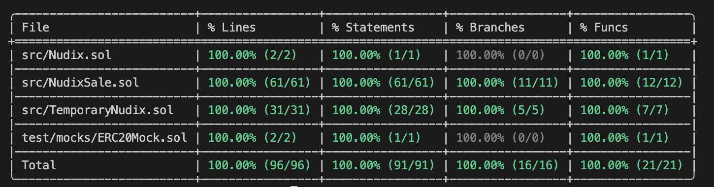

# Audit Scoping Details

Short description: Public sale for temporary token of protocol (T-NUDIX).

**Public code repo:** https://github.com/Nudix2/contracts

**Branch:** main

**Commit:** d4c133931a1cf218213cd7ca749518170fe35424

**Target network:** BNB Smart Chain

The context of the project and the steps to get started can be found in the main [README.md](./README.md).

## Contract scope

Contracts in scope:
- [TemporaryNudix.sol](src/TemporaryNudix.sol)
- [NudixSale.sol](src/NudixSale.sol)

Interfaces in scope:
- [ITemporaryNudix.sol](src/interfaces/ITemporaryNudix.sol)
- [INudixSale.sol](src/interfaces/INudixSale.sol)

_Important!_ [Nudix.sol](src/Nudix.sol) is out of scope and not subject to audit.

Total SLoC: 215 (excluding Nudix.sol)

## External imports

The project uses a well-known library OpenZeppelin. The following contracts are used:
- ERC20.sol, IERC20.sol, ERC20Burnable.sol, ERC20Permit, SafeERC20.sol
- ReentrancyGuardTransient
- Ownable.sol
- AccessControl.sol

## Tests

Tests are written using the foundry framework. They are located in the folder `test`. Coverage is 100%.

Scripts were ignored.

## Additional information

We don't use any oracle, timelock, nft, amm.

USDT (decimal 18) will be used as payment token for NudixSale contract.

In the future, it is planned that a smart contract will be implemented that will allow exchanging T-NUDIX for NUDIX.